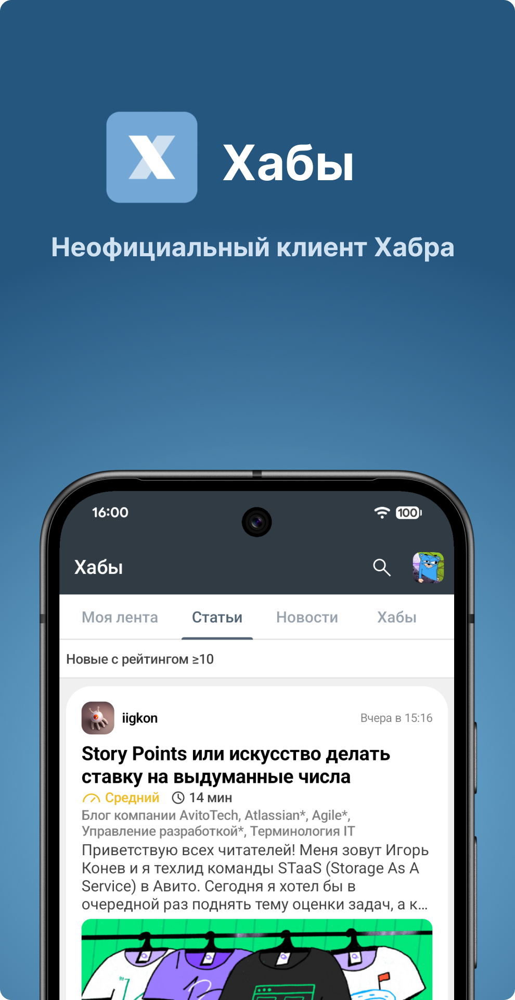
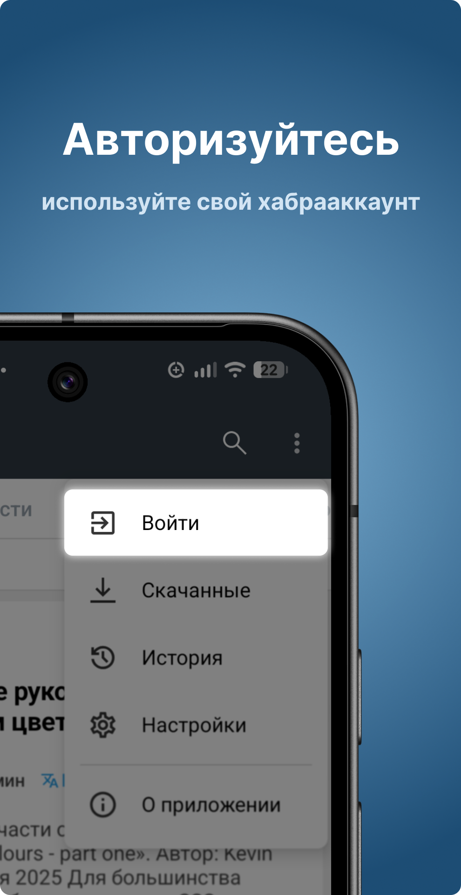
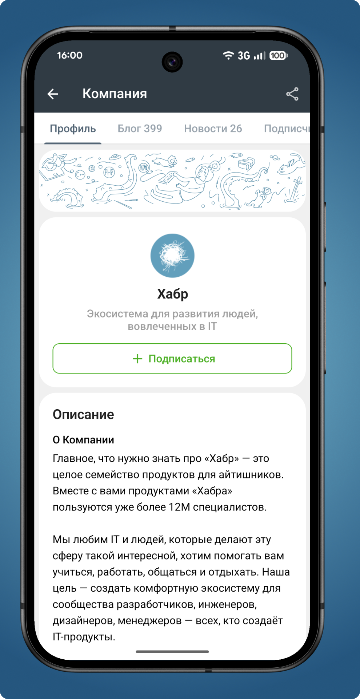
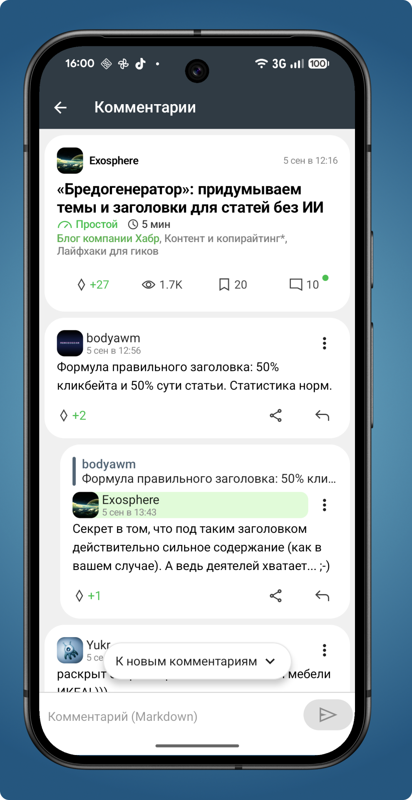
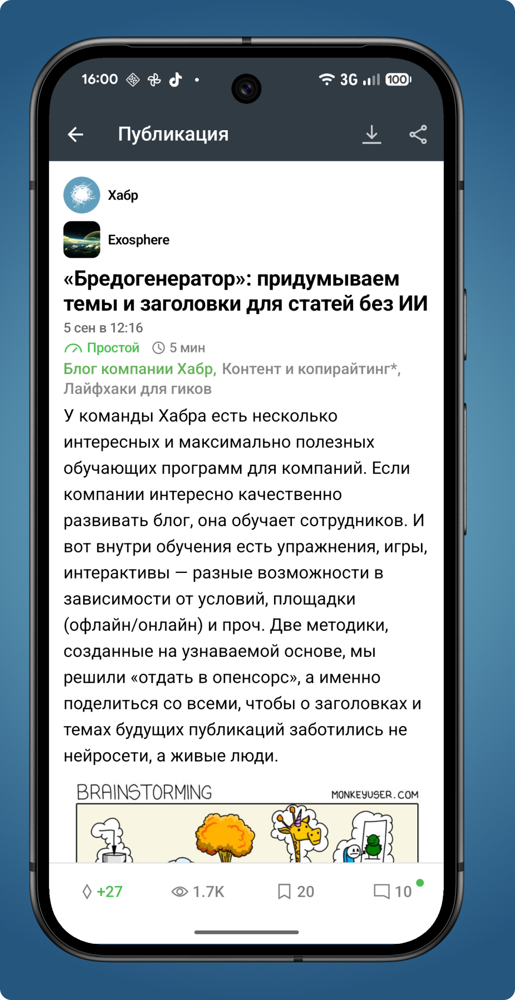

# Хабы 
Неофициальный мобильный клиент для Хабра с открытым исходным кодом. Создан для изучения Jetpack Compose и Android. 

  
 

  

### [Домашняя страница проекта](https://garneg.github.io/hubs)

### Установите на [4pda](https://4pda.to/forum/index.php?showtopic=1065764) или через [релизы](https://github.com/Garneg/Hubs/releases)
